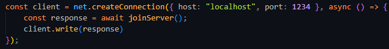

# Shrapster

File sharing program intented to learn about socket comunication between a client and a server.
The project was made as a proof of concept for the Distributed Systems discipline

### Instructions

To run the project

1. First, download packages and dependencies
```
    npm install
```

2. In a terminal window, start running the server by running
```
    npm run start
```
3. In another terminal window, start running the client by running
```
    npm run client
```

4. If you wish to download files from different peers make your friends run this :) 

5. if you want to download files but you're not in the same network, download a tool like RadminVPN or Hamachi and create a LAN Network

6. If you would like to connect with another client, follow the protocol available down bellow and just connect to your server 



You just have to change -> `localhost` to the ipv4 where the server is running


# Protocol

### Client -> Server Calls

1. JOIN { IP-ADRESS }
2. CREATEFILE { FILENAME } { SIZE IN BYTES }
3. DELETEFILE { FILENAME }
4. SEARCH { PATTERN }
5. LEAVE

### Server -> Client Calls

1. CONFIRMJOIN
2. CONFIRMCREATEFILE { FILENAME }
3. CONFIRMDELETEFILE { FILENAME }
4. FILE { FILENAME } {IP - ADDRESS } { SIZE IN BYTES }
   FILE { FILENAME } {IP - ADDRESS } { SIZE IN BYTES }
   ...

### Client -> Client Calls

GET { FILENAME } { OFFSET START } -[ OFFSET END ]

# Contributors

[Artur Almeida](https://www.genome.gov/)
[Immanuel Victor](https://www.genome.gov/)
